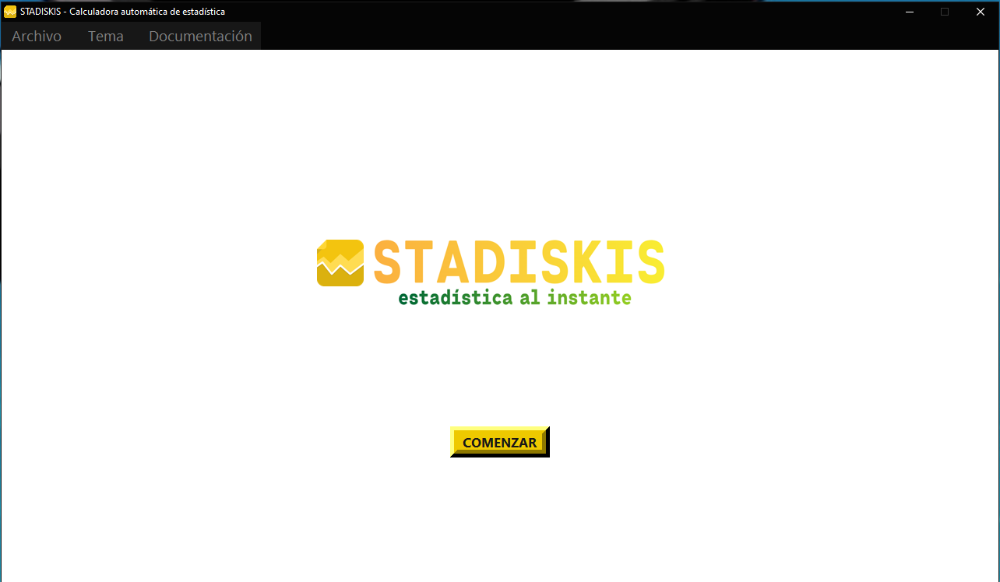
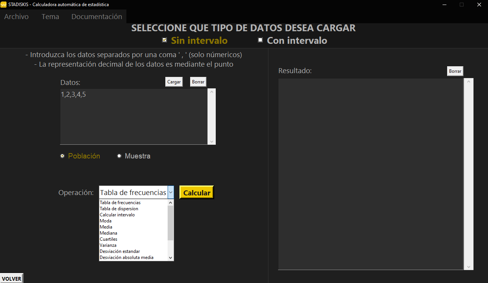

# 📊 Stadiskis Software v0.1

## 🔎 ¿Qué es Stadiskis?
Desarrollado completamente en Python, esta es una app para calculos complejos de estadistica.
Devolviendo desde graficos o datos de dispersion hasta el calculo automatico de intervalos. 

## 📥 Descarga
Puede descargar el codigo de este proyecto o descargar el ejecutable que se encuentra en formato zip "EJECUTABLE ZIP", el cual incluye todas las librerias y modulos de modo que se podra ejecutar en cualquier computadora sin necesidad de tener Python.

## ⚠️ Reportes y sugerencias
Si el programa presenta algún error que debería ser reportado para arreglarlo, si podría haber alguna nueva funcionalidad para agregar al programa, o si algo podría ser modificado, puedes hablarlo conmigo personalmente mediante mail karim.dev.tech@gmail.com

## 📸 Capturas de pantalla
*Ventana del menú principal*
 

*Ventana del menú principal*
 

*Ventana para cargar datos sin intervalo*

*Ventana para cargar datos con intervalo*

\

*Ventana para cargar datos con intervalo*

\

*Ventana para cargar datos con intervalo*

*Ventana para cargar datos con intervalo*

![menuCon](STADISKIS/capturas/menucon.p
![menuCon](STADISKIS/capturas/menucon.p

